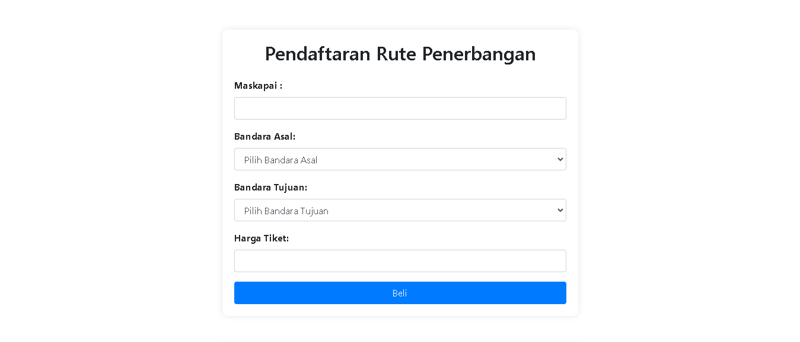
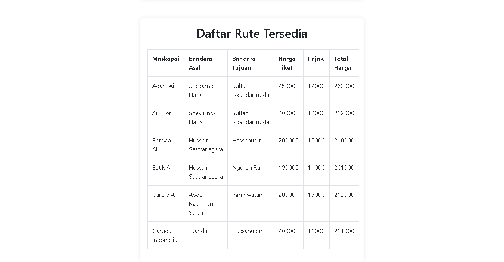

# Pendaftaran Rute Penerbangan ✈️✈️✈️


## Deskripsi
Program Pendaftaran Rute Penerbangan adalah aplikasi berbasis web yang memungkinkan pengguna untuk mendaftarkan rute penerbangan dengan informasi seperti maskapai, bandara asal dan tujuan, serta menghitung total harga tiket termasuk pajak. Program ini dibangun menggunakan PHP untuk sisi server dan Bootstrap untuk tampilan.

## Fitur
- Penambahan Nama Maskapai: Pengguna dapat menambahkan nama maskapai yang akan ditambahkan rute penerbangannya.
- Pemilihan Bandara Asal dan Tujuan: Pengguna dapat memilih bandara asal dan tujuan dari daftar yang telah disediakan.
- Penentuan Harga Tiket: Harga tiket dihitung berdasarkan rute yang dipilih.
- Penambahan Pajak: Pajak ditambahkan ke harga tiket untuk mendapatkan total harga yang harus dibayar.
- Output Total Harga: Total harga tiket termasuk pajak ditampilkan setelah pengguna mengisi formulir.

## Tech
- PHP 8.0.0 atau lebih tinggi
- Xampp
- Visual Studio Code
- Server web (misalnya, Apache, Nginx)
- Browser web untuk melihat output dari program

## Screenshoots



## Structure
```
├── README.md
├── index.php
├── controller
│   └── action.php
├── data
│   ├── data.json
│   └── pajak.json
├── img
│   └── screenshot
│       ├── form.png
│       └── table.png
└── library
    └── style.css
```


## Instalasi
1. Clone repositori atau unduh file proyek.
    bash
    git clone https://github.com/kamachiii/rute-penerbangan

2. Pastikan server web Anda berjalan dan lingkungan PHP sudah diatur dengan benar.
3. Tempatkan file proyek di direktori root server web Anda (misalnya, htdocs untuk XAMPP atau www untuk WAMP).

## Penggunaan
1. Buka browser web.
2. Navigasikan ke direktori proyek (misalnya, http://localhost/rute-penerbangan).
3. Pada halaman web, Masukkan nama Anda sebagai pemesan tiket.
4. Pilih Asal dan tujuan bandara dari daftar yang disediakan.
5. Jangan lupa masukkan harga tiket keberangkatan tersebut.
6. Sistem akan menghitung total pajak dan menampilkan total harga yang harus dibayar.
